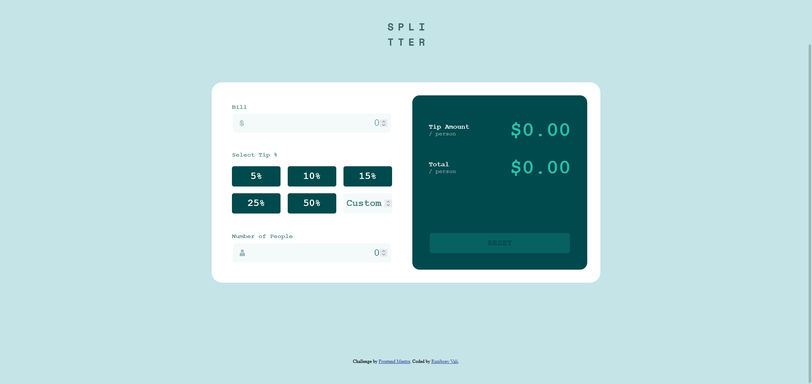

# Frontend Mentor - Tip calculator app solution

This is a solution to the [Tip calculator app challenge on Frontend Mentor](https://www.frontendmentor.io/challenges/tip-calculator-app-ugJNGbJUX). Frontend Mentor challenges help you improve your coding skills by building realistic projects.

### The challenge

Users should be able to:

- View the optimal layout for the app depending on their device's screen size
- See hover states for all interactive elements on the page
- Calculate the correct tip and total cost of the bill per person

### Screenshot

### Links

- Live Site URL: 

### Built with

- Semantic HTML5 markup
- CSS custom properties
- CSS Grid
- Vanilla JS

## Author

- Frontend Mentor - [@Vali-Ruziboev](https://www.frontendmentor.io/profile/Vali-Ruziboev)
- Instagram - [valiruziboev](https://www.instagram.com/valiruziboev/)
